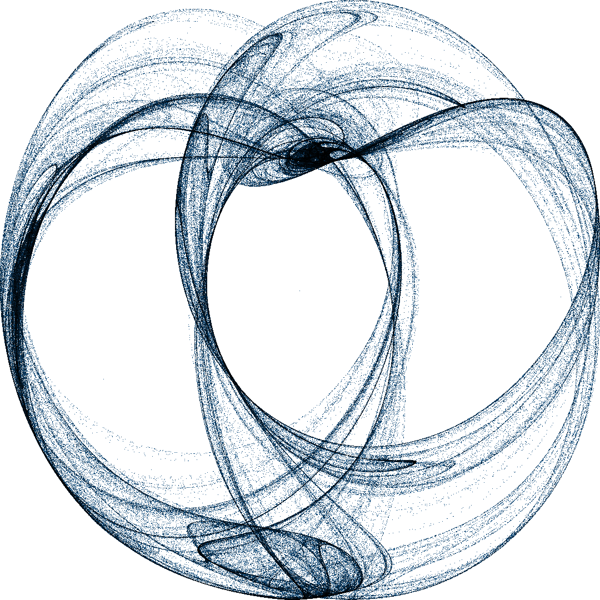

# Attractors

This repos allows you to create beautiful pictures of the `Clifford` and `Peter de Jong` attractors using the `datashader` package.



## Clifford

Some interesting patterns can be obtained using this range of parameters

```
    (a, b, c, d) = (-1.4,  1.6,  1.0,  0.7)
                 = (-1.8, -2.0, -0.5, -0.9)
                 = ( 1.7,  1.7,  0.6,  1.2)
                 = ( 1.5, -1.8,  1.6,  0.9)
                 = (-1.7,  1.8, -1.9, -0.4)
```

## de Jong 

```
    (a, b, d, c) = ( 1.40, -2.30, 2.40, -2.10)
                   ( 2.01, -2.53, 1.61, -0.33)
                   (-0.709,1.638, 0.452, 1.740)
                   (-2.00, -2.00, -1.20, 2.00)

```